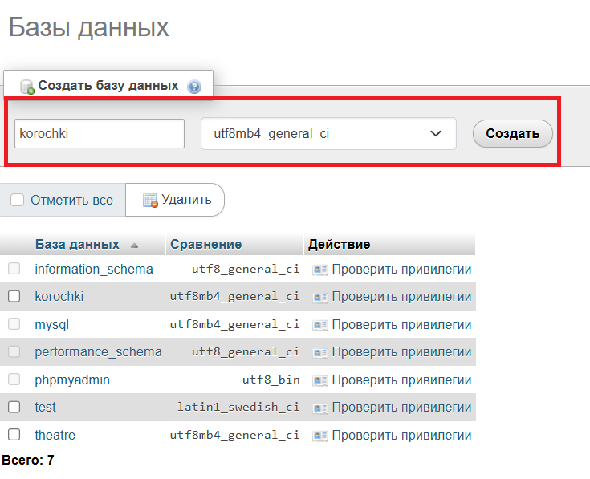
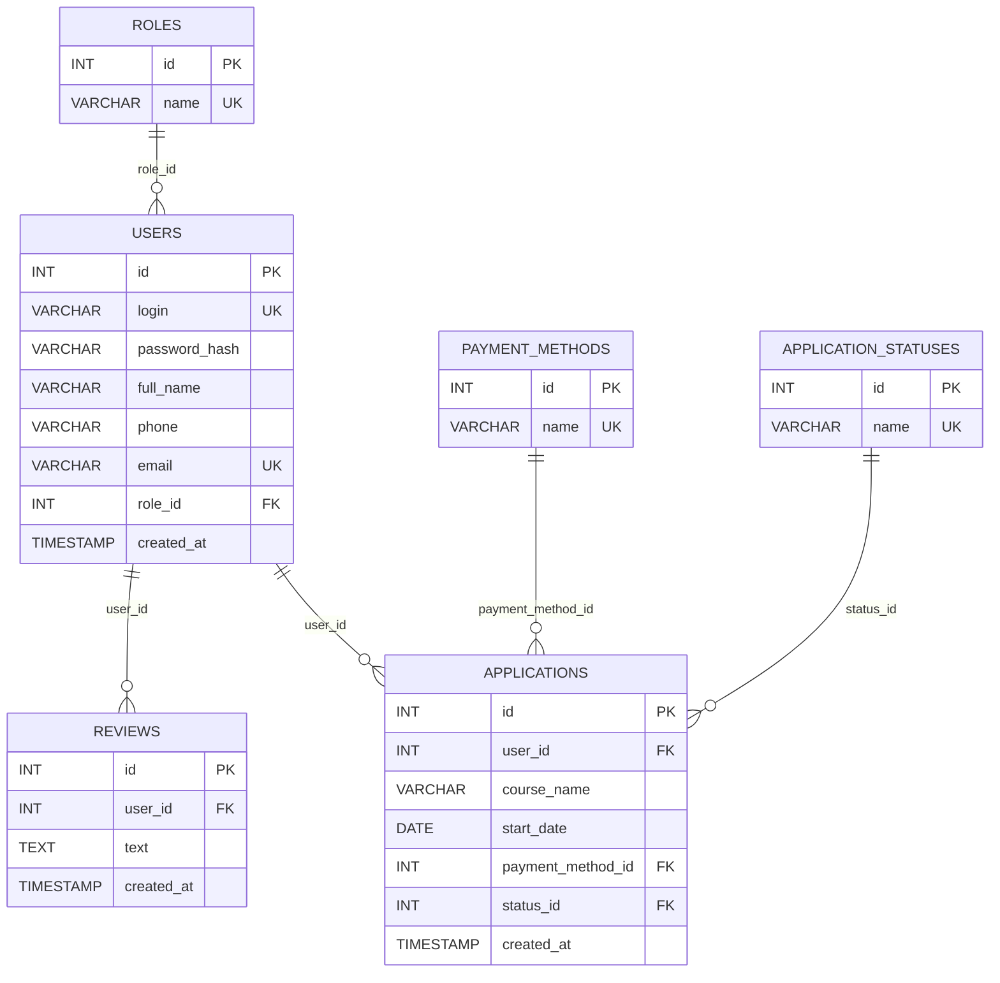
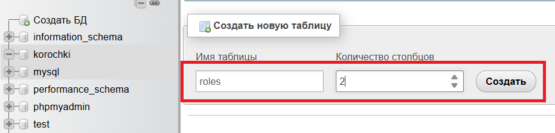
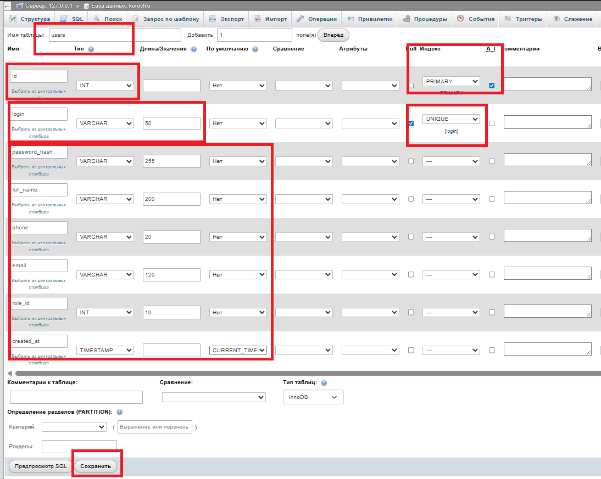
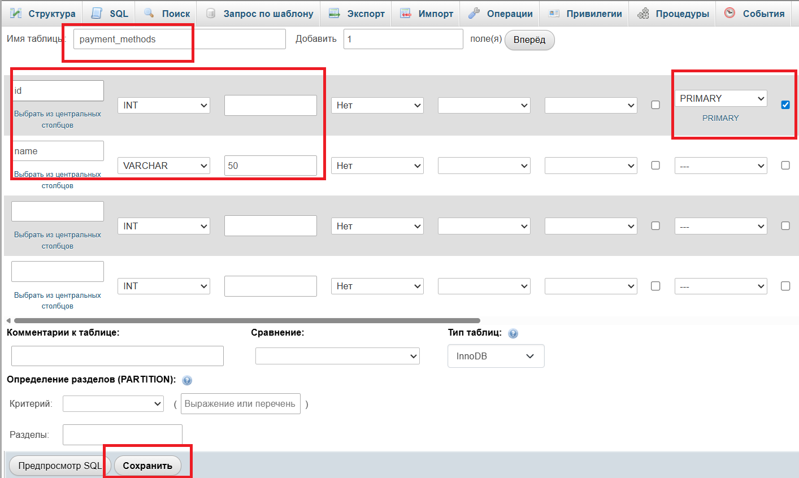
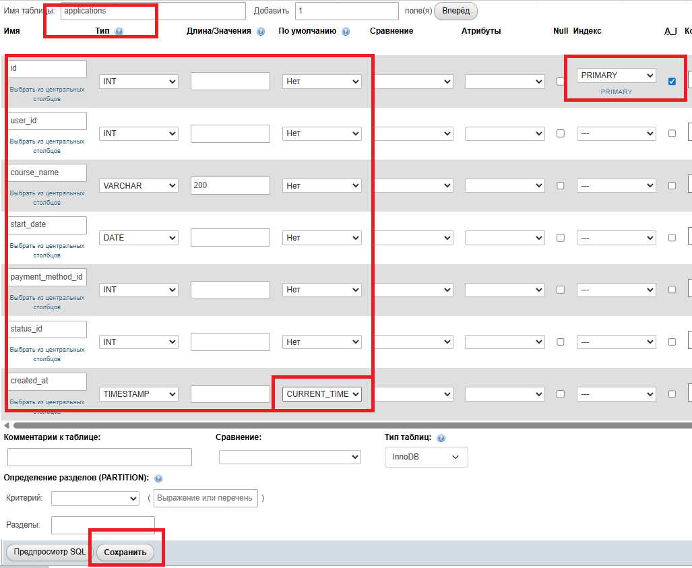
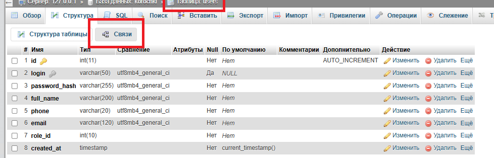
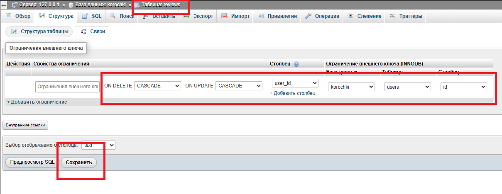
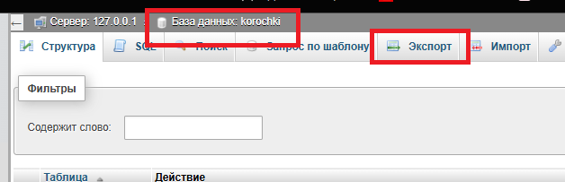
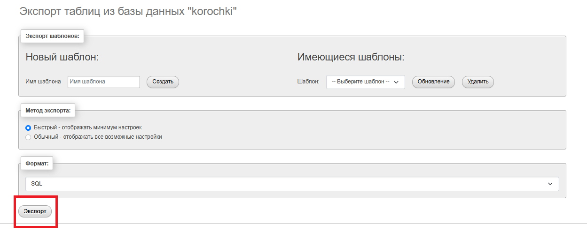

# Модуль 1. Пример решения

## 1. Git-репозиторий

### Первый коммит (начало работы)

```bash
git clone <url-репозитория>
# создайте структуру проекта
git add .
git commit -m "Начало работы над модулем 1"
git push
```

### Финальный коммит (завершение)

```bash
git add .
git commit -m "Завершение выполнения модуля 1"
git push
```

---

## 2. База данных

> Используется XAMPP: Apache + MySQL, phpMyAdmin.

### 2.1. Запуск XAMPP

1. Откройте **XAMPP Control Panel**.
2. Нажмите **Start** для **Apache** и **MySQL**.


///caption
Рисунок 1 — Запуск XAMPP
///

3. Откройте `http://localhost/phpmyadmin`.


///caption
Рисунок 2 — phpMyAdmin
///

---

### 2.2. Создание базы данных

1. Вкладка **Базы данных** → имя `korochki`, кодировка `utf8mb4_general_ci` → **Создать**.


///caption
Рисунок 3 — Создание базы данных
///

---

### 2.3. Схема данных (3НФ)

Минимальные сущности по заданию:



///caption
ER-диаграмма базы данных «Корочки.есть»
///

---

### 2.4. Создание таблиц в phpMyAdmin

#### Таблица `roles`

Вкладка базы `korochki` → **Создать таблицу** → имя `roles`, 2 столбца.

| Поле | Тип | Атрибуты |
|------|-----|---------|
| `id` | INT | PRIMARY KEY, AUTO_INCREMENT |
| `name` | VARCHAR(30) | NOT NULL, UNIQUE |


///caption
Рисунок 4 — Создание таблицы roles
///


///caption
Рисунок 5 — Поля таблицы roles
///

#### Таблица `users`

8 столбцов:

| Поле | Тип | Атрибуты |
|------|-----|---------|
| `id` | INT | PRIMARY KEY, AUTO_INCREMENT |
| `login` | VARCHAR(50) | NOT NULL, UNIQUE |
| `password_hash` | VARCHAR(255) | NOT NULL |
| `full_name` | VARCHAR(200) | NOT NULL |
| `phone` | VARCHAR(20) | NOT NULL |
| `email` | VARCHAR(120) | NOT NULL, UNIQUE |
| `role_id` | INT | NOT NULL |
| `created_at` | TIMESTAMP | DEFAULT CURRENT_TIMESTAMP |


///caption
Рисунок 6 — Создание таблицы users
///

#### Таблица `payment_methods`

| Поле | Тип | Атрибуты |
|------|-----|---------|
| `id` | INT | PRIMARY KEY, AUTO_INCREMENT |
| `name` | VARCHAR(50) | NOT NULL, UNIQUE |


///caption
Рисунок 7 — Создание таблицы payment_methods
///

#### Таблица `application_statuses`

| Поле | Тип | Атрибуты |
|------|-----|---------|
| `id` | INT | PRIMARY KEY, AUTO_INCREMENT |
| `name` | VARCHAR(50) | NOT NULL, UNIQUE |


///caption
Рисунок 8 — Создание таблицы application_statuses
///

#### Таблица `applications`

7 столбцов:

| Поле | Тип | Атрибуты |
|------|-----|---------|
| `id` | INT | PRIMARY KEY, AUTO_INCREMENT |
| `user_id` | INT | NOT NULL |
| `course_name` | VARCHAR(200) | NOT NULL |
| `start_date` | DATE | NOT NULL |
| `payment_method_id` | INT | NOT NULL |
| `status_id` | INT | NOT NULL |
| `created_at` | TIMESTAMP | DEFAULT CURRENT_TIMESTAMP |


///caption
Рисунок 9 — Создание таблицы applications
///

#### Таблица `reviews`

| Поле | Тип | Атрибуты |
|------|-----|---------|
| `id` | INT | PRIMARY KEY, AUTO_INCREMENT |
| `user_id` | INT | NOT NULL |
| `text` | TEXT | NOT NULL |
| `created_at` | TIMESTAMP | DEFAULT CURRENT_TIMESTAMP |


///caption
Рисунок 10 — Создание таблицы reviews
///

---

### 2.5. Внешние ключи (FK)

#### Таблица `users`

Откройте `users` → **Структура** → **Связи (Relation view)**:


///caption
Рисунок 11 — Вкладка «Связи»
///

- `role_id` → `roles.id`, ON DELETE: RESTRICT, ON UPDATE: CASCADE


///caption
Рисунок 12 — FK в таблице users
///

#### Таблица `applications`

- `user_id` → `users.id`, ON DELETE: CASCADE, ON UPDATE: CASCADE
- `payment_method_id` → `payment_methods.id`, ON DELETE: RESTRICT, ON UPDATE: CASCADE
- `status_id` → `application_statuses.id`, ON DELETE: RESTRICT, ON UPDATE: CASCADE


///caption
Рисунок 13 — FK в таблице applications
///

#### Таблица `reviews`

- `user_id` → `users.id`, ON DELETE: CASCADE, ON UPDATE: CASCADE


///caption
Рисунок 14 — FK в таблице reviews
///

> После создания FK внесите тестовые данные для проверки работы БД.

---

### 2.6. ER-диаграмма средствами СУБД

1. Откройте базу `korochki` → вкладка **Designer (Конструктор)**.


///caption
Рисунок 15 — Вкладка Designer
///

2. Убедитесь, что отображены все таблицы и связи.
3. Сделайте скриншот (`Win+Shift+S`) и сохраните как `er-diagram-korochki.png`.


///caption
Рисунок 16 — ER-диаграмма в phpMyAdmin Designer
///

---

### 2.7. Экспорт SQL-дампа

1. Откройте базу `korochki` → вкладка **Экспорт**.
2. Метод: **Быстро**, формат: **SQL** → **Вперёд**.


///caption
Рисунок 17 — Экспорт базы данных
///


///caption
Рисунок 18 — Скачивание SQL-файла
///

Добавьте `korochki.sql` в репозиторий (папка `db/`).

---

## 3. Полный стек: Flask + MySQL

> **Структура проекта:**
> ```
> korochki/
> ├── backend/
> │   └── app.py
> ├── frontend/
> │   ├── register.html
> │   ├── login.html
> │   ├── applications.html
> │   ├── create_application.html
> │   ├── admin.html
> │   └── styles.css
> └── db/
>     └── korochki.sql
> ```

### Установка зависимостей

```bash
pip install flask flask-cors pymysql
```

---

### 3.1. `backend/app.py` — полный файл

Все маршруты и API-эндпоинты в одном файле:

```python
from flask import Flask, request, jsonify, send_from_directory
import os, re, hashlib
import pymysql
from flask_cors import CORS

app = Flask(__name__)
CORS(app)

FRONTEND_DIR = os.path.join(os.path.dirname(__file__), "..", "frontend")

DB_CONFIG = {
    "host": "127.0.0.1", "user": "root", "password": "",
    "database": "korochki", "charset": "utf8mb4",
    "cursorclass": pymysql.cursors.DictCursor
}

RE_LOGIN    = re.compile(r"^[A-Za-z0-9]{6,}$")   # логин: латиница/цифры, от 6
RE_FULLNAME = re.compile(r"^[А-Яа-яЁё\s]+$")
RE_PHONE    = re.compile(r"^8\(\d{3}\)\d{3}-\d{2}-\d{2}$")
RE_EMAIL    = re.compile(r"^[^@\s]+@[^@\s]+\.[^@\s]+$")

def pw(p): return hashlib.sha256(p.encode()).hexdigest()
def db():  return pymysql.connect(**DB_CONFIG)

# ── Страницы ──────────────────────────────────────────────────────────────────
app.add_url_rule("/",                   "pg_idx",    lambda: send_from_directory(FRONTEND_DIR,"login.html"))
app.add_url_rule("/login",              "pg_login",  lambda: send_from_directory(FRONTEND_DIR,"login.html"))
app.add_url_rule("/register",           "pg_reg",    lambda: send_from_directory(FRONTEND_DIR,"register.html"))
app.add_url_rule("/applications",       "pg_apps",   lambda: send_from_directory(FRONTEND_DIR,"applications.html"))
app.add_url_rule("/create_application","pg_create",  lambda: send_from_directory(FRONTEND_DIR,"create_application.html"))
app.add_url_rule("/admin",              "pg_admin",  lambda: send_from_directory(FRONTEND_DIR,"admin.html"))
app.add_url_rule("/styles.css",         "pg_css",    lambda: send_from_directory(FRONTEND_DIR,"styles.css"))
app.add_url_rule("/slider.js",          "pg_sldr",   lambda: send_from_directory(FRONTEND_DIR,"slider.js"))
app.add_url_rule("/assets/<path:fp>",   "pg_assets", lambda fp: send_from_directory(os.path.join(FRONTEND_DIR,"assets"),fp))

# ── API ───────────────────────────────────────────────────────────────────────
@app.post("/api/register")
def register():
    d = request.get_json(silent=True) or {}
    login    = (d.get("login") or "").strip()
    password = d.get("password") or ""
    fname    = (d.get("full_name") or "").strip()
    phone    = (d.get("phone") or "").strip()
    email    = (d.get("email") or "").strip()
    if not all([login, password, fname, phone, email]):
        return jsonify({"error": "Все поля обязательны."}), 400
    if not RE_LOGIN.match(login):
        return jsonify({"error": "Логин: латиница/цифры, от 6 символов."}), 400
    if len(password) < 8:
        return jsonify({"error": "Пароль: не менее 8 символов."}), 400
    if not RE_FULLNAME.match(fname):
        return jsonify({"error": "ФИО: только кириллица и пробелы."}), 400
    if not RE_PHONE.match(phone):
        return jsonify({"error": "Телефон: формат 8(XXX)XXX-XX-XX."}), 400
    if not RE_EMAIL.match(email):
        return jsonify({"error": "Email: неверный формат."}), 400
    try:
        conn = db()
        with conn:
            with conn.cursor() as cur:
                cur.execute("SELECT id FROM users WHERE login=%s OR email=%s", (login, email))
                if cur.fetchone():
                    return jsonify({"error": "Логин или email уже заняты."}), 409
                cur.execute("SELECT id FROM roles WHERE name='user'")
                role = cur.fetchone()
                cur.execute(
                    "INSERT INTO users (login,password_hash,full_name,phone,email,role_id)"
                    " VALUES (%s,%s,%s,%s,%s,%s)",
                    (login, pw(password), fname, phone, email, role["id"])
                )
            conn.commit()
        return jsonify({"message": "Пользователь создан."}), 201
    except Exception:
        return jsonify({"error": "Ошибка сервера."}), 500

@app.post("/api/login")
def login():
    d = request.get_json(silent=True) or {}
    login_val = (d.get("login") or "").strip()
    password  = d.get("password") or ""
    if not login_val or not password:
        return jsonify({"error": "Введите логин и пароль."}), 400
    try:
        conn = db()
        with conn:
            with conn.cursor() as cur:
                cur.execute(
                    "SELECT u.id, r.name AS role, u.password_hash"
                    " FROM users u JOIN roles r ON r.id=u.role_id WHERE u.login=%s",
                    (login_val,)
                )
                user = cur.fetchone()
        if not user or user["password_hash"] != pw(password):
            return jsonify({"error": "Неверный логин или пароль."}), 401
        return jsonify({"message": "Вход выполнен.", "user_id": user["id"], "role": user["role"]}), 200
    except Exception:
        return jsonify({"error": "Ошибка сервера."}), 500

@app.get("/api/applications/my")
def my_apps():
    uid = request.args.get("user_id", "").strip()
    if not uid.isdigit():
        return jsonify({"error": "Требуется user_id."}), 400
    try:
        conn = db()
        with conn:
            with conn.cursor() as cur:
                cur.execute("""
                    SELECT a.id, a.course_name,
                           DATE_FORMAT(a.start_date,'%%Y-%%m-%%d') AS start_date,
                           pm.name AS payment_method, st.name AS status,
                           DATE_FORMAT(a.created_at,'%%Y-%%m-%%d %%H:%%i') AS created_at
                    FROM applications a
                    JOIN payment_methods pm ON pm.id = a.payment_method_id
                    JOIN application_statuses st ON st.id = a.status_id
                    WHERE a.user_id = %s ORDER BY a.id DESC
                """, (int(uid),))
                return jsonify({"applications": cur.fetchall()}), 200
    except Exception:
        return jsonify({"error": "Ошибка сервера."}), 500

@app.post("/api/applications")
def create_app():
    d       = request.get_json(silent=True) or {}
    uid     = d.get("user_id")
    course  = (d.get("course_name") or "").strip()
    start   = (d.get("start_date") or "").strip()
    pm_name = (d.get("payment_method") or "").strip()
    if not isinstance(uid, int) or uid <= 0:
        return jsonify({"error": "Требуется user_id."}), 400
    if not course:
        return jsonify({"error": "Укажите курс."}), 400
    if not start:
        return jsonify({"error": "Укажите дату."}), 400
    if pm_name not in ("Наличными", "Переводом по номеру телефона"):
        return jsonify({"error": "Выберите способ оплаты."}), 400
    try:
        conn = db()
        with conn:
            with conn.cursor() as cur:
                cur.execute("SELECT id FROM users WHERE id=%s", (uid,))
                if not cur.fetchone():
                    return jsonify({"error": "Пользователь не найден."}), 404
                cur.execute("SELECT id FROM payment_methods WHERE name=%s", (pm_name,))
                pm = cur.fetchone()
                cur.execute("SELECT id FROM application_statuses WHERE name='Новая'")
                st = cur.fetchone()
                cur.execute(
                    "INSERT INTO applications (user_id,course_name,start_date,payment_method_id,status_id)"
                    " VALUES (%s,%s,%s,%s,%s)",
                    (uid, course, start, pm["id"], st["id"])
                )
            conn.commit()
        return jsonify({"message": "Заявка создана."}), 201
    except Exception:
        return jsonify({"error": "Ошибка сервера."}), 500

@app.post("/api/reviews")
def add_review():
    d    = request.get_json(silent=True) or {}
    uid  = d.get("user_id")
    text = (d.get("text") or "").strip()
    if not isinstance(uid, int) or uid <= 0:
        return jsonify({"error": "Требуется user_id."}), 400
    if not text:
        return jsonify({"error": "Текст отзыва обязателен."}), 400
    try:
        conn = db()
        with conn:
            with conn.cursor() as cur:
                cur.execute("SELECT id FROM users WHERE id=%s", (uid,))
                if not cur.fetchone():
                    return jsonify({"error": "Пользователь не найден."}), 404
                cur.execute("INSERT INTO reviews (user_id,text) VALUES (%s,%s)", (uid, text))
            conn.commit()
        return jsonify({"message": "Отзыв добавлен."}), 201
    except Exception:
        return jsonify({"error": "Ошибка сервера."}), 500

@app.get("/api/admin/applications")
def admin_apps():
    try:
        conn = db()
        with conn:
            with conn.cursor() as cur:
                cur.execute("""
                    SELECT a.id, u.login AS user_login, a.course_name,
                           DATE_FORMAT(a.start_date,'%%Y-%%m-%%d') AS start_date,
                           pm.name AS payment_method, st.name AS status
                    FROM applications a
                    JOIN users u ON u.id = a.user_id
                    JOIN payment_methods pm ON pm.id = a.payment_method_id
                    JOIN application_statuses st ON st.id = a.status_id
                    ORDER BY a.id DESC
                """)
                return jsonify({"applications": cur.fetchall()}), 200
    except Exception:
        return jsonify({"error": "Ошибка сервера."}), 500

@app.patch("/api/admin/applications/<int:app_id>/status")
def admin_status(app_id):
    d     = request.get_json(silent=True) or {}
    sname = (d.get("status") or "").strip()
    if sname not in {"Новая", "Идёт обучение", "Обучение завершено"}:
        return jsonify({"error": "Недопустимый статус."}), 400
    try:
        conn = db()
        with conn:
            with conn.cursor() as cur:
                cur.execute("SELECT id FROM application_statuses WHERE name=%s", (sname,))
                st = cur.fetchone()
                if not st:
                    return jsonify({"error": "Статус не найден."}), 500
                cur.execute("UPDATE applications SET status_id=%s WHERE id=%s", (st["id"], app_id))
                if cur.rowcount == 0:
                    return jsonify({"error": "Заявка не найдена."}), 404
            conn.commit()
        return jsonify({"message": "Статус обновлён."}), 200
    except Exception:
        return jsonify({"error": "Ошибка сервера."}), 500

if __name__ == "__main__":
    app.run(host="127.0.0.1", port=5000, debug=True)
```

> **Все маршруты:**
>
> | Метод | Путь | Назначение |
> |-------|------|-----------|
> | GET | `/` | Перенаправление на login |
> | GET | `/login` | Страница авторизации |
> | GET | `/register` | Страница регистрации |
> | GET | `/applications` | Список заявок пользователя |
> | GET | `/create_application` | Форма новой заявки |
> | GET | `/admin` | Панель администратора |
> | POST | `/api/register` | Регистрация пользователя |
> | POST | `/api/login` | Авторизация |
> | GET | `/api/applications/my` | Заявки текущего пользователя |
> | POST | `/api/applications` | Создание заявки |
> | POST | `/api/reviews` | Добавление отзыва |
> | GET | `/api/admin/applications` | Все заявки (админ) |
> | PATCH | `/api/admin/applications/<id>/status` | Смена статуса (админ) |

---

### 3.2. `frontend/register.html`

> **HTML5-валидация** через `pattern` + `minlength` + `required`. Запрос к `/api/register`.

```html
<!doctype html>
<html lang="ru">
<head>
  <meta charset="utf-8">
  <meta name="viewport" content="width=device-width, initial-scale=1">
  <title>Регистрация — Корочки.есть</title>
  <link rel="stylesheet" href="/styles.css">
</head>
<body>
<div class="container">
  <h1>Регистрация</h1>
  <div class="card">
    <form id="f">
      <div class="field">
        <label>Логин</label>
        <input name="login" required minlength="6" pattern="^[A-Za-z0-9]{6,}$"
               placeholder="Латиница/цифры, от 6 символов">
      </div>
      <div class="field">
        <label>Пароль</label>
        <input name="password" type="password" required minlength="8"
               placeholder="Минимум 8 символов">
      </div>
      <div class="field">
        <label>ФИО</label>
        <input name="full_name" required pattern="^[А-Яа-яЁё\s]+$"
               placeholder="Кириллица и пробелы">
      </div>
      <div class="field">
        <label>Телефон</label>
        <input name="phone" required pattern="^8\(\d{3}\)\d{3}-\d{2}-\d{2}$"
               placeholder="8(XXX)XXX-XX-XX">
      </div>
      <div class="field">
        <label>Email</label>
        <input name="email" type="email" required placeholder="name@example.com">
      </div>
      <div class="actions">
        <button type="submit">Создать пользователя</button>
      </div>
      <p id="msg" class="msg"></p>
    </form>
  </div>
  <p><a href="/login">Уже зарегистрированы? Войти</a></p>
</div>
<script>
const f = document.getElementById("f"), msg = document.getElementById("msg");
f.addEventListener("submit", async e => {
  e.preventDefault();
  msg.textContent = "";
  if (!f.checkValidity()) { msg.textContent = "Проверьте поля."; return; }
  const res = await fetch("/api/register", {
    method: "POST",
    headers: { "Content-Type": "application/json" },
    body: JSON.stringify({
      login: f.login.value.trim(), password: f.password.value,
      full_name: f.full_name.value.trim(), phone: f.phone.value.trim(),
      email: f.email.value.trim()
    })
  });
  const j = await res.json().catch(() => ({}));
  msg.textContent = res.ok ? "Пользователь создан." : j.error || "Ошибка.";
  msg.className   = res.ok ? "msg ok" : "msg error";
  if (res.ok) f.reset();
});
</script>
</body>
</html>
```

---

### 3.3. `frontend/login.html`

> Авторизация. После входа сохраняет `user_id` и `role` в `localStorage`, перенаправляет на `/admin` (если admin) или `/applications`.

```html
<!doctype html>
<html lang="ru">
<head>
  <meta charset="utf-8">
  <meta name="viewport" content="width=device-width, initial-scale=1">
  <title>Авторизация — Корочки.есть</title>
  <link rel="stylesheet" href="/styles.css">
</head>
<body>
<div class="container">
  <h1>Авторизация</h1>
  <div class="card">
    <form id="f">
      <div class="field">
        <label>Логин</label>
        <input name="login" required placeholder="Введите логин">
      </div>
      <div class="field">
        <label>Пароль</label>
        <input name="password" type="password" required placeholder="Введите пароль">
      </div>
      <div class="actions">
        <button type="submit">Войти</button>
      </div>
      <p id="msg" class="msg"></p>
    </form>
  </div>
  <p><a href="/register">Еще не зарегистрированы? Регистрация</a></p>
</div>
<script>
const f = document.getElementById("f"), msg = document.getElementById("msg");
f.addEventListener("submit", async e => {
  e.preventDefault();
  msg.textContent = "";
  const res = await fetch("/api/login", {
    method: "POST",
    headers: { "Content-Type": "application/json" },
    body: JSON.stringify({ login: f.login.value.trim(), password: f.password.value })
  });
  const j = await res.json().catch(() => ({}));
  if (!res.ok) {
    msg.textContent = j.error || "Неверные данные.";
    msg.className = "msg error";
    return;
  }
  localStorage.setItem("user_id", j.user_id);
  localStorage.setItem("role", j.role);
  window.location.href = j.role === "admin" ? "/admin" : "/applications";
});
</script>
</body>
</html>
```

---

### 3.4. `frontend/applications.html`

> Список заявок пользователя + форма отзыва.

```html
<!doctype html>
<html lang="ru">
<head>
  <meta charset="utf-8">
  <meta name="viewport" content="width=device-width, initial-scale=1">
  <title>Мои заявки — Корочки.есть</title>
  <link rel="stylesheet" href="/styles.css">
</head>
<body>
<div class="container">
  <h1>Мои заявки</h1>
  <div id="authWarn" style="display:none">
    <p>Требуется авторизация.</p><a href="/login">Войти</a>
  </div>
  <div id="content" style="display:none">
    <h2>Список заявок</h2>
    <div style="overflow-x:auto">
      <table class="table">
        <thead><tr><th>ID</th><th>Курс</th><th>Дата</th><th>Оплата</th><th>Статус</th><th>Создана</th></tr></thead>
        <tbody id="tbody"></tbody>
      </table>
    </div>
    <p><a href="/create_application">+ Новая заявка</a></p>

    <div class="card">
      <h2>Отзыв</h2>
      <div id="reviewStatus" class="msg"></div>
      <form id="reviewForm">
        <div class="field">
          <label>Текст отзыва</label>
          <textarea id="reviewText" placeholder="Введите отзыв" disabled></textarea>
        </div>
        <div class="actions">
          <button id="reviewSubmit" type="submit" disabled>Отправить отзыв</button>
        </div>
        <p id="reviewMsg" class="msg"></p>
      </form>
    </div>

    <p id="msg" class="msg"></p>
  </div>
</div>
<script>
const uid = localStorage.getItem("user_id");

if (!uid) {
  document.getElementById("authWarn").style.display = "block";
} else {
  document.getElementById("content").style.display = "block";

  async function load() {
    const res = await fetch("/api/applications/my?user_id=" + uid);
    const j   = await res.json().catch(() => ({}));
    if (!res.ok) {
      document.getElementById("msg").textContent = j.error || "Ошибка.";
      return;
    }
    const apps = j.applications || [];
    const tb   = document.getElementById("tbody");
    tb.innerHTML = apps.length
      ? apps.map(a => `<tr><td>${a.id}</td><td>${a.course_name}</td>
          <td>${a.start_date}</td><td>${a.payment_method}</td>
          <td>${a.status}</td><td>${a.created_at}</td></tr>`).join("")
      : "<tr><td colspan='6'>Заявок нет</td></tr>";

    // Отзыв доступен только после завершения курса
    const done = apps.some(a => a.status === "Обучение завершено");
    const rs   = document.getElementById("reviewStatus");
    const rt   = document.getElementById("reviewText");
    const rb   = document.getElementById("reviewSubmit");
    if (done) {
      rs.className = "msg ok";
      rs.textContent = "Курс завершён. Можно оставить отзыв.";
      rt.disabled = rb.disabled = false;
    } else {
      rs.className = "msg error";
      rs.textContent = "Отзыв доступен только после завершения курса.";
      document.getElementById("reviewForm").classList.add("is-locked");
    }
  }
  load();

  document.getElementById("reviewForm").addEventListener("submit", async e => {
    e.preventDefault();
    const text = document.getElementById("reviewText").value.trim();
    if (!text) return;
    const res = await fetch("/api/reviews", {
      method: "POST",
      headers: { "Content-Type": "application/json" },
      body: JSON.stringify({ user_id: Number(uid), text })
    });
    const j = await res.json().catch(() => ({}));
    const rm = document.getElementById("reviewMsg");
    rm.textContent = res.ok ? "Отзыв отправлен." : j.error || "Ошибка.";
    rm.className   = res.ok ? "msg ok" : "msg error";
    if (res.ok) document.getElementById("reviewText").value = "";
  });
}
</script>
</body>
</html>
```

---

### 3.5. `frontend/create_application.html`

> Форма новой заявки. Курс — свободный ввод (в модуле 1). Дата — тип `date`.

```html
<!doctype html>
<html lang="ru">
<head>
  <meta charset="utf-8">
  <meta name="viewport" content="width=device-width, initial-scale=1">
  <title>Новая заявка — Корочки.есть</title>
  <link rel="stylesheet" href="/styles.css">
</head>
<body>
<div class="container">
  <h1>Новая заявка</h1>
  <div id="authWarn" style="display:none">
    <p>Требуется авторизация.</p><a href="/login">Войти</a>
  </div>
  <div id="content" style="display:none">
    <div class="card">
      <form id="f">
        <div class="field">
          <label>Наименование курса</label>
          <input name="course_name" required placeholder="Введите название курса">
        </div>
        <div class="field">
          <label>Желаемая дата начала обучения</label>
          <input name="start_date" type="date" required>
        </div>
        <div class="field">
          <label>Способ оплаты</label>
          <label><input type="radio" name="pm" value="Наличными" required> Наличными</label><br>
          <label><input type="radio" name="pm" value="Переводом по номеру телефона"> Переводом по номеру телефона</label>
        </div>
        <div class="actions">
          <button type="submit">Отправить</button>
          <a href="/applications">Назад</a>
        </div>
        <p id="msg" class="msg"></p>
      </form>
    </div>
  </div>
</div>
<script>
const uid = localStorage.getItem("user_id");
if (!uid) {
  document.getElementById("authWarn").style.display = "block";
} else {
  document.getElementById("content").style.display = "block";
  const f = document.getElementById("f"), msg = document.getElementById("msg");
  f.addEventListener("submit", async e => {
    e.preventDefault();
    msg.textContent = "";
    const pm = f.querySelector("input[name=pm]:checked");
    if (!pm) { msg.textContent = "Выберите способ оплаты."; return; }
    const res = await fetch("/api/applications", {
      method: "POST",
      headers: { "Content-Type": "application/json" },
      body: JSON.stringify({
        user_id: Number(uid),
        course_name: f.course_name.value.trim(),
        start_date: f.start_date.value,
        payment_method: pm.value
      })
    });
    const j = await res.json().catch(() => ({}));
    msg.textContent = res.ok ? "Заявка отправлена." : j.error || "Ошибка.";
    msg.className   = res.ok ? "msg ok" : "msg error";
    if (res.ok) f.reset();
  });
}
</script>
</body>
</html>
```

---

### 3.6. `frontend/admin.html`

> Минимальная панель администратора: таблица всех заявок, смена статуса.

```html
<!doctype html>
<html lang="ru">
<head>
  <meta charset="utf-8">
  <meta name="viewport" content="width=device-width, initial-scale=1">
  <title>Администратор — Корочки.есть</title>
  <link rel="stylesheet" href="/styles.css">
</head>
<body>
<div class="container">
  <h1>Панель администратора</h1>
  <div id="accessWarn" style="display:none">
    <p>Доступ запрещён.</p><a href="/login">Войти</a>
  </div>
  <div id="content" style="display:none">
    <h2>Все заявки</h2>
    <div style="overflow-x:auto">
      <table class="table">
        <thead><tr>
          <th>ID</th><th>Логин</th><th>Курс</th>
          <th>Дата</th><th>Оплата</th><th>Статус</th><th>Действие</th>
        </tr></thead>
        <tbody id="tbody"></tbody>
      </table>
    </div>
    <p id="msg" class="msg"></p>
  </div>
</div>
<script>
const role = localStorage.getItem("role");
if (role !== "admin") {
  document.getElementById("accessWarn").style.display = "block";
} else {
  document.getElementById("content").style.display = "block";

  function render(apps) {
    const tb = document.getElementById("tbody");
    tb.innerHTML = apps.length
      ? apps.map(a => `<tr>
          <td>${a.id}</td><td>${a.user_login}</td><td>${a.course_name}</td>
          <td>${a.start_date}</td><td>${a.payment_method}</td>
          <td><select class="ss" data-id="${a.id}">
            <option ${a.status==="Новая"?"selected":""}>Новая</option>
            <option ${a.status==="Идёт обучение"?"selected":""}>Идёт обучение</option>
            <option ${a.status==="Обучение завершено"?"selected":""}>Обучение завершено</option>
          </select></td>
          <td><button class="sb" data-id="${a.id}">Сохранить</button></td>
        </tr>`).join("")
      : "<tr><td colspan='7'>Заявок нет</td></tr>";
    tb.querySelectorAll(".sb").forEach(b => b.addEventListener("click", async () => {
      const id  = b.dataset.id;
      const sel = tb.querySelector(`.ss[data-id="${id}"]`);
      const res = await fetch(`/api/admin/applications/${id}/status`, {
        method: "PATCH",
        headers: { "Content-Type": "application/json" },
        body: JSON.stringify({ status: sel.value })
      });
      const j = await res.json().catch(() => ({}));
      const msg = document.getElementById("msg");
      msg.textContent = res.ok ? "Статус обновлён." : j.error || "Ошибка.";
      msg.className   = res.ok ? "msg ok" : "msg error";
    }));
  }

  async function load() {
    const res = await fetch("/api/admin/applications");
    const j   = await res.json().catch(() => ({}));
    if (!res.ok) { document.getElementById("msg").textContent = j.error || "Ошибка."; return; }
    render(j.applications || []);
  }
  load();
}
</script>
</body>
</html>
```

---

### 3.7. `frontend/styles.css`

> Минимальный CSS с поддержкой mobile-first, `.card`, `.field`, `.table`, `.msg`.

```css
:root {
  --bg: #fff; --text: #222; --muted: #666; --border: #d7d7d7;
  --surface: #f7f7f7; --focus: #1a73e8; --danger: #b00020; --ok: #0b8043;
}
* { box-sizing: border-box; }
body { margin: 0; font-family: Arial, sans-serif; background: var(--bg); color: var(--text); }
.container { max-width: 760px; margin: 16px auto; padding: 0 14px; }
h1, h2 { margin: 0 0 16px; font-weight: 700; } h2 { margin-top: 24px; }
.card { background: var(--surface); border: 1px solid var(--border); border-radius: 10px; padding: 16px; }
.field { margin-bottom: 12px; }
label { display: inline-block; margin-bottom: 6px; font-weight: 600; }
input, textarea, select { width: 100%; padding: 12px; border: 1px solid var(--border); border-radius: 8px; background: #fff; font-size: 16px; }
textarea { resize: vertical; min-height: 110px; }
input:focus, textarea:focus, select:focus { outline: 2px solid var(--focus); outline-offset: 1px; }
.actions { display: flex; gap: 10px; align-items: center; margin-top: 14px; }
button { padding: 12px 14px; min-height: 44px; border: 1px solid var(--border); border-radius: 8px; background: #fff; cursor: pointer; font-weight: 700; }
button:hover { filter: brightness(0.98); }
a { color: var(--focus); text-decoration: none; } a:hover { text-decoration: underline; }
.msg { margin-top: 12px; white-space: pre-line; color: var(--muted); }
.msg.error { color: var(--danger); } .msg.ok { color: var(--ok); }
.table { width: 100%; border-collapse: collapse; background: #fff; border: 1px solid var(--border); border-radius: 10px; overflow: hidden; display: block; overflow-x: auto; }
.table th, .table td { border-bottom: 1px solid var(--border); padding: 10px; text-align: left; font-size: 14px; white-space: nowrap; }
.table th { background: var(--surface); font-weight: 700; }
#reviewForm.is-locked { opacity: .75; }
#reviewForm.is-locked textarea, #reviewForm.is-locked button { cursor: not-allowed; }
@media (min-width: 640px) { .table { display: table; overflow-x: visible; } .table th, .table td { white-space: normal; } }
@media (min-width: 1024px) { .container { max-width: 980px; margin: 28px auto; } }
```

---

## 4. Запуск и проверка

```bash
py backend/app.py
```

Откройте `http://127.0.0.1:5000/login`.

| Логин | Пароль | Роль |
|-------|--------|------|
| `Admin` | `KorokNET` | Администратор |

!!! tip "Хэш пароля Admin"
    В БД хранится sha256-хэш. Выполните в Python и обновите таблицу `users`:
    ```python
    import hashlib
    print(hashlib.sha256("KorokNET".encode()).hexdigest())
    ```
    ```sql
    UPDATE users SET password_hash = 'ВАШ_ХЭШ' WHERE login = 'Admin';
    ```

---

## 5. Результат модуля 1

Сделайте финальный коммит:

```bash
git add .
git commit -m "Завершение выполнения модуля 1"
git push
```

Репозиторий должен содержать:

- [ ] `backend/app.py`
- [ ] `frontend/*.html`, `frontend/styles.css`
- [ ] `db/korochki.sql`
- [ ] ER-диаграмма (`db/er-diagram-korochki.png`)

---

👉 [Скачать SQL базы данных](../assets/files/korochki.sql)

👉 [Скачать пример готового приложения (Модуль 1)](../assets/files/gdrmi-demo.zip)
