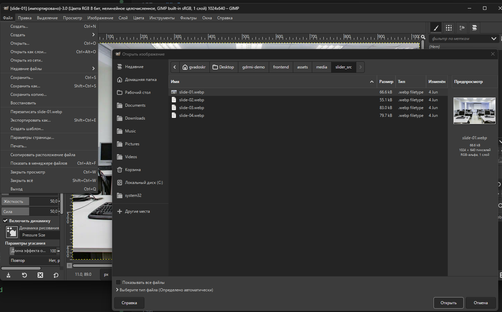
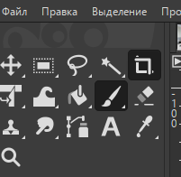
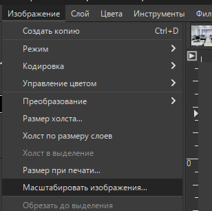

# Модуль 2. Пример решения

!!! info "Основа"
    Модуль 2 продолжает проект из Модуля 1. Открывайте тот же репозиторий.

## 1. Первый коммит

```bash
git add .
git commit -m "Начало модуля 2: дизайн и адаптивность"
git push
```

---

## 2. Подготовка изображений для слайдера

### 2.1. Получение файлов

Распакуйте архив `Прил_ОЗ_КОД 09.02.07-3-2026-М2.zip`. Внутри — папка `media/` с изображениями (`image01`…`image18`, разные форматы).

Создайте папку в проекте: `frontend/assets/media/slider/`.

### 2.2. Обработка в GIMP

Задача — получить 4 изображения одинакового размера **1024×576** (16:9), формат WebP.


///caption
Рисунок 1 — Запуск GIMP
///

1. `Файл → Открыть` → выбрать изображение.


///caption
Рисунок 2 — Открытие изображения
///

2. Инструмент **Кадрирование** → **Фиксированное: Соотношение сторон `16:9`** → выделить область → Enter.


///caption
Рисунок 3 — Инструмент «Кадрирование»
///


///caption
Рисунок 4 — Кадрирование под 16:9
///

3. `Изображение → Масштабировать изображение` → ширина `1024`, высота `576` → **Масштабировать**.


///caption
Рисунок 5 — Масштабирование до 1024×576
///

4. `Файл → Экспортировать как` → папка `frontend/assets/media/slider/` → имя `slide-01.webp`.


///caption
Рисунок 6 — Команда «Экспортировать как»
///

5. Качество WebP: **80** (без lossless).


///caption
Рисунок 7 — Параметры экспорта WebP
///

Повторите для остальных 3 изображений: `slide-02.webp`, `slide-03.webp`, `slide-04.webp`.

> **Норма веса:** 100–300 KB на файл. Если больше — уменьшите качество до 70–75.

---

## 3. Адаптивный CSS (mobile-first)

### 3.1. Обновить `frontend/styles.css`

Замените содержимое файла на расширенную версию с mobile-first, слайдером, toast и состояниями форм:

```css
:root {
  --bg: #fff; --text: #222; --muted: #666; --border: #d7d7d7;
  --surface: #f7f7f7; --focus: #1a73e8; --danger: #b00020; --ok: #0b8043;
}
* { box-sizing: border-box; }
body { margin: 0; font-family: Arial, sans-serif; background: var(--bg); color: var(--text); }

/* mobile-first: базовые отступы под 390×844 */
.container { max-width: 760px; margin: 16px auto; padding: 0 14px; }
h1, h2 { margin: 0 0 16px; font-weight: 700; } h2 { margin-top: 24px; }
.card { background: var(--surface); border: 1px solid var(--border); border-radius: 10px; padding: 16px; }
.field { margin-bottom: 12px; }
label { display: inline-block; margin-bottom: 6px; font-weight: 600; }

/* mobile-first: font-size 16px предотвращает zoom на iOS */
input, textarea, select {
  width: 100%; padding: 12px; border: 1px solid var(--border);
  border-radius: 8px; background: #fff; font-size: 16px;
}
textarea { resize: vertical; min-height: 110px; }
input:focus, textarea:focus, select:focus { outline: 2px solid var(--focus); outline-offset: 1px; }

/* mobile-first: 1 колонка по умолчанию */
.row { display: grid; grid-template-columns: 1fr; gap: 12px; }
.actions { display: flex; gap: 10px; align-items: center; margin-top: 14px; }

/* удобная кнопка для нажатия (min 44px) */
button {
  padding: 12px 14px; min-height: 44px; border: 1px solid var(--border);
  border-radius: 8px; background: #fff; cursor: pointer; font-weight: 700;
}
button:hover { filter: brightness(0.98); }
a { color: var(--focus); text-decoration: none; } a:hover { text-decoration: underline; }
.msg { margin-top: 12px; white-space: pre-line; color: var(--muted); }
.msg.error { color: var(--danger); } .msg.ok { color: var(--ok); }

/* таблица с горизонтальной прокруткой на узких экранах */
.table {
  width: 100%; border-collapse: collapse; background: #fff;
  border: 1px solid var(--border); border-radius: 10px; overflow: hidden;
  display: block; overflow-x: auto; -webkit-overflow-scrolling: touch;
}
.table th, .table td { border-bottom: 1px solid var(--border); padding: 10px; text-align: left; font-size: 14px; white-space: nowrap; }
.table th { background: var(--surface); font-weight: 700; }
.badge { display: inline-block; padding: 3px 8px; border: 1px solid var(--border); border-radius: 999px; font-size: 12px; background: var(--surface); }

/* состояния полей */
.is-error { border-color: var(--danger) !important; }
.is-ok    { border-color: var(--ok) !important; }
.field-hint { margin-top: 6px; font-size: 12px; color: var(--muted); }
.field-hint.error { color: var(--danger); } .field-hint.ok { color: var(--ok); }

/* слайдер */
.slider { position: relative; margin: 14px 0 18px; border: 1px solid var(--border); border-radius: 12px; overflow: hidden; background: #fff; }
.slides { position: relative; height: 210px; }
.slide { position: absolute; inset: 0; width: 100%; height: 100%; object-fit: cover; opacity: 0; transform: scale(1.02); transition: opacity 400ms ease, transform 400ms ease; }
.slide.is-active { opacity: 1; transform: scale(1); }
.slider-btn { position: absolute; top: 50%; transform: translateY(-50%); width: 42px; height: 42px; border-radius: 999px; border: 1px solid var(--border); background: rgba(255,255,255,.85); display: inline-flex; align-items: center; justify-content: center; cursor: pointer; font-weight: 700; }
.slider-btn.prev { left: 10px; } .slider-btn.next { right: 10px; }

/* заблокированная форма отзыва */
#reviewForm.is-locked { opacity: .75; }
#reviewForm.is-locked textarea, #reviewForm.is-locked button { cursor: not-allowed; }

/* toast */
.toast {
  position: fixed; left: 50%; bottom: 16px; transform: translateX(-50%);
  min-width: 260px; max-width: 92vw; padding: 12px 14px;
  border-radius: 12px; border: 1px solid var(--border); background: #fff;
  box-shadow: 0 6px 24px rgba(0,0,0,.12);
  opacity: 0; pointer-events: none; transition: opacity 250ms ease;
}
.toast.show { opacity: 1; pointer-events: auto; }
.toast.ok    { border-color: rgba(11,128,67,.35); }
.toast.error { border-color: rgba(176,0,32,.35); }

/* от 640px: две колонки, десктопные размеры */
@media (min-width: 640px) {
  .row { grid-template-columns: 1fr 1fr; }
  input, textarea, select { font-size: 14px; padding: 10px 12px; }
  button { min-height: 0; padding: 10px 14px; }
  .table { display: table; overflow-x: visible; }
  .table th, .table td { white-space: normal; }
  .slides { height: 260px; }
}

/* от 1024px */
@media (min-width: 1024px) {
  .container { max-width: 980px; margin: 28px auto; }
  .slides { height: 300px; }
}
```

---

## 4. Слайдер изображений

### 4.1. HTML-блок слайдера

Добавьте на страницу `applications.html` (внутри `#content`, перед таблицей заявок):

```html
<div class="card">
  <div class="slider" id="slider">
    <div class="slides">
      
      
      
      
    </div>
    <button class="slider-btn prev" type="button" aria-label="Назад">&#10094;</button>
    <button class="slider-btn next" type="button" aria-label="Вперёд">&#10095;</button>
  </div>
</div>
```

### 4.2. `frontend/slider.js`

```javascript
(function () {
  const slider = document.getElementById("slider");
  if (!slider) return;

  const slides = Array.from(slider.querySelectorAll(".slide"));
  let index = 0, timerId = null;

  function showSlide(n) {
    slides[index].classList.remove("is-active");
    index = (n + slides.length) % slides.length;
    slides[index].classList.add("is-active");
  }
  function next() { showSlide(index + 1); }
  function prev() { showSlide(index - 1); }
  function start() { timerId = setInterval(next, 3000); }
  function stop()  { clearInterval(timerId); timerId = null; }

  slider.querySelector(".next")?.addEventListener("click", () => { next(); stop(); start(); });
  slider.querySelector(".prev")?.addEventListener("click", () => { prev(); stop(); start(); });
  slider.addEventListener("mouseenter", stop);
  slider.addEventListener("mouseleave", start);
  slider.addEventListener("touchstart", stop,  { passive: true });
  slider.addEventListener("touchend",   start);

  start();
})();
```

Подключите в конце `applications.html` (перед `</body>`):

```html
<script src="/slider.js"></script>
```

Маршрут `/slider.js` уже добавлен в `backend/app.py` на этапе Модуля 1 — ничего менять не нужно.

---

## 5. Обновление страниц (дизайн + валидация)

### 5.1. `register.html` — валидация на форме

Добавьте `.card` → `.field` → inline-подсказки об ошибках:

```html
<!doctype html>
<html lang="ru">
<head>
  <meta charset="utf-8">
  <meta name="viewport" content="width=device-width, initial-scale=1">
  <title>Регистрация — Корочки.есть</title>
  <link rel="stylesheet" href="/styles.css">
</head>
<body>
<div class="container">
  <h1>Регистрация</h1>
  <div class="card">
    <form id="f" novalidate>
      <div class="field">
        <label for="login">Логин</label>
        <input id="login" name="login" required minlength="6"
               pattern="^[A-Za-z0-9]{6,}$" placeholder="Латиница/цифры, от 6 символов">
        <div class="field-hint error" id="loginErr" style="display:none"></div>
      </div>
      <div class="field">
        <label for="password">Пароль</label>
        <input id="password" name="password" type="password" required minlength="8"
               placeholder="Минимум 8 символов">
        <div class="field-hint error" id="passErr" style="display:none"></div>
      </div>
      <div class="field">
        <label for="full_name">ФИО</label>
        <input id="full_name" name="full_name" required
               pattern="^[А-Яа-яЁё\s]+$" placeholder="Кириллица и пробелы">
        <div class="field-hint error" id="nameErr" style="display:none"></div>
      </div>
      <div class="field">
        <label for="phone">Телефон</label>
        <input id="phone" name="phone" required
               pattern="^8\(\d{3}\)\d{3}-\d{2}-\d{2}$" placeholder="8(XXX)XXX-XX-XX">
        <div class="field-hint error" id="phoneErr" style="display:none"></div>
      </div>
      <div class="field">
        <label for="email">Email</label>
        <input id="email" name="email" type="email" required placeholder="name@example.com">
        <div class="field-hint error" id="emailErr" style="display:none"></div>
      </div>
      <div class="actions">
        <button type="submit">Зарегистрироваться</button>
      </div>
      <p id="msg" class="msg"></p>
    </form>
  </div>
  <p><a href="/login">Уже зарегистрированы? Войти</a></p>
</div>
<script>
const f = document.getElementById("f"), msg = document.getElementById("msg");
const fields = [
  { id: "login",     errId: "loginErr",  text: "Логин: латиница/цифры, от 6 символов" },
  { id: "password",  errId: "passErr",   text: "Пароль: не менее 8 символов" },
  { id: "full_name", errId: "nameErr",   text: "ФИО: только кириллица и пробелы" },
  { id: "phone",     errId: "phoneErr",  text: "Телефон: формат 8(XXX)XXX-XX-XX" },
  { id: "email",     errId: "emailErr",  text: "Укажите корректный email" },
];

function validate() {
  let ok = true;
  for (const fd of fields) {
    const el  = document.getElementById(fd.id);
    const err = document.getElementById(fd.errId);
    if (!el.validity.valid) {
      el.classList.add("is-error"); el.classList.remove("is-ok");
      err.textContent = fd.text; err.style.display = "block";
      ok = false;
    } else {
      el.classList.remove("is-error"); el.classList.add("is-ok");
      err.style.display = "none";
    }
  }
  return ok;
}

f.addEventListener("submit", async e => {
  e.preventDefault();
  msg.textContent = "";
  if (!validate()) return;
  const res = await fetch("/api/register", {
    method: "POST",
    headers: { "Content-Type": "application/json" },
    body: JSON.stringify({
      login: f.login.value.trim(), password: f.password.value,
      full_name: f.full_name.value.trim(), phone: f.phone.value.trim(),
      email: f.email.value.trim()
    })
  });
  const j = await res.json().catch(() => ({}));
  msg.textContent = res.ok ? "Пользователь зарегистрирован." : j.error || "Ошибка.";
  msg.className   = res.ok ? "msg ok" : "msg error";
  if (res.ok) { f.reset(); for (const fd of fields) { document.getElementById(fd.id).className = ""; } }
});
</script>
</body>
</html>
```

---

### 5.2. `create_application.html` — выпадающий список + формат ДД.ММ.ГГГГ

По требованию модуля 2 курс выбирается из списка, дата вводится в формате **ДД.ММ.ГГГГ**:

```html
<!doctype html>
<html lang="ru">
<head>
  <meta charset="utf-8">
  <meta name="viewport" content="width=device-width, initial-scale=1">
  <title>Новая заявка — Корочки.есть</title>
  <link rel="stylesheet" href="/styles.css">
</head>
<body>
<div class="container">
  <h1>Новая заявка</h1>
  <div id="authWarn" style="display:none">
    <p>Требуется авторизация.</p><a href="/login">Войти</a>
  </div>
  <div id="content" style="display:none">
    <div class="card">
      <form id="f">
        <div class="field">
          <label for="course">Наименование курса</label>
          <select id="course" name="course" required>
            <option value="">— Выберите курс —</option>
            <option>Основы алгоритмизации и программирования</option>
            <option>Основы веб-дизайна</option>
            <option>Основы проектирования баз данных</option>
          </select>
        </div>
        <div class="field">
          <label for="startDate">Желаемая дата начала обучения</label>
          <input id="startDate" name="startDate" type="text"
                 inputmode="numeric" placeholder="ДД.ММ.ГГГГ" required>
          <div class="field-hint">Формат ввода: ДД.ММ.ГГГГ</div>
        </div>
        <div class="field">
          <label>Способ оплаты</label>
          <label><input type="radio" name="pm" value="Наличными" required> Наличными</label><br>
          <label><input type="radio" name="pm" value="Переводом по номеру телефона">
            Переводом по номеру телефона</label>
        </div>
        <div class="actions">
          <button type="submit">Отправить заявку</button>
          <a href="/applications">К списку заявок</a>
        </div>
        <p id="msg" class="msg"></p>
      </form>
    </div>
  </div>
</div>
<script>
const uid = localStorage.getItem("user_id");
if (!uid) {
  document.getElementById("authWarn").style.display = "block";
} else {
  document.getElementById("content").style.display = "block";
  const f = document.getElementById("f"), msg = document.getElementById("msg");
  f.addEventListener("submit", async e => {
    e.preventDefault();
    msg.textContent = "";
    const pm = f.querySelector("input[name=pm]:checked");
    if (!pm) { msg.textContent = "Выберите способ оплаты."; msg.className = "msg error"; return; }
    const d = f.startDate.value.trim();
    const m = d.match(/^(\d{2})\.(\d{2})\.(\d{4})$/);
    if (!m) { msg.textContent = "Формат даты: ДД.ММ.ГГГГ"; msg.className = "msg error"; return; }
    const isoDate = `${m[3]}-${m[2]}-${m[1]}`;
    const res = await fetch("/api/applications", {
      method: "POST",
      headers: { "Content-Type": "application/json" },
      body: JSON.stringify({
        user_id: Number(uid), course_name: f.course.value,
        start_date: isoDate, payment_method: pm.value
      })
    });
    const j = await res.json().catch(() => ({}));
    msg.textContent = res.ok ? "Заявка отправлена." : j.error || "Ошибка.";
    msg.className   = res.ok ? "msg ok" : "msg error";
    if (res.ok) f.reset();
  });
}
</script>
</body>
</html>
```

---

### 5.3. `admin.html` — фильтрация, пагинация, toast

```html
<!doctype html>
<html lang="ru">
<head>
  <meta charset="utf-8">
  <meta name="viewport" content="width=device-width, initial-scale=1">
  <title>Администратор — Корочки.есть</title>
  <link rel="stylesheet" href="/styles.css">
</head>
<body>
<div class="container">
  <h1>Панель администратора</h1>
  <div id="accessWarn" style="display:none">
    <p>Доступ запрещён.</p><a href="/login">Войти</a>
  </div>
  <div id="content" style="display:none">

    <!-- Фильтры -->
    <div class="card">
      <h2>Фильтры</h2>
      <div class="row">
        <div class="field">
          <label>Статус</label>
          <select id="fStatus">
            <option value="">Все</option>
            <option>Новая</option>
            <option>Идёт обучение</option>
            <option>Обучение завершено</option>
          </select>
        </div>
        <div class="field">
          <label>Поиск</label>
          <input id="fText" type="text" placeholder="Логин или курс">
        </div>
      </div>
      <div class="actions">
        <button id="applyF">Применить</button>
        <button id="resetF">Сбросить</button>
        <button id="reload">Обновить</button>
      </div>
    </div>

    <!-- Таблица -->
    <div style="overflow-x:auto">
      <table class="table">
        <thead><tr>
          <th>ID</th><th>Логин</th><th>Курс</th>
          <th>Дата</th><th>Оплата</th><th>Статус</th><th>Действие</th>
        </tr></thead>
        <tbody id="tbody"></tbody>
      </table>
    </div>

    <!-- Пагинация -->
    <div class="card" style="margin-top:12px">
      <div class="actions" style="justify-content:space-between">
        <button id="pagePrev">Назад</button>
        <span class="badge" id="pageInfo">Стр. 1</span>
        <button id="pageNext">Вперёд</button>
      </div>
    </div>

    <p id="msg" class="msg"></p>
  </div>
</div>
<div id="toast" class="toast"></div>
<script>
const role = localStorage.getItem("role");
if (role !== "admin") {
  document.getElementById("accessWarn").style.display = "block";
} else {
  document.getElementById("content").style.display = "block";
  let all = [], filt = [], page = 1;
  const PS = 6;

  function toast(type, text) {
    const t = document.getElementById("toast");
    t.className = `toast show ${type}`;
    t.textContent = text;
    setTimeout(() => { t.className = "toast"; t.textContent = ""; }, 2500);
  }

  function render(items) {
    const tb = document.getElementById("tbody");
    tb.innerHTML = items.length
      ? items.map(a => `<tr>
          <td>${a.id}</td><td>${a.user_login}</td><td>${a.course_name}</td>
          <td>${a.start_date}</td><td>${a.payment_method}</td>
          <td><select class="ss" data-id="${a.id}">
            <option ${a.status==="Новая"?"selected":""}>Новая</option>
            <option ${a.status==="Идёт обучение"?"selected":""}>Идёт обучение</option>
            <option ${a.status==="Обучение завершено"?"selected":""}>Обучение завершено</option>
          </select></td>
          <td><button class="sb" data-id="${a.id}">Сохранить</button></td>
        </tr>`).join("")
      : "<tr><td colspan='7'>Заявок нет</td></tr>";
    tb.querySelectorAll(".sb").forEach(b => b.addEventListener("click", async () => {
      const id  = b.dataset.id;
      const sel = tb.querySelector(`.ss[data-id="${id}"]`);
      const res = await fetch(`/api/admin/applications/${id}/status`, {
        method: "PATCH",
        headers: { "Content-Type": "application/json" },
        body: JSON.stringify({ status: sel.value })
      });
      const j = await res.json().catch(() => ({}));
      toast(res.ok ? "ok" : "error", res.ok ? "Статус сохранён" : j.error || "Ошибка");
      if (res.ok) {
        [all, filt].forEach(arr => {
          const x = arr.find(a => String(a.id) === id);
          if (x) x.status = sel.value;
        });
      }
    }));
  }

  function renderPage() {
    const s = (page - 1) * PS;
    render(filt.slice(s, s + PS));
    const tp = Math.max(1, Math.ceil(filt.length / PS));
    document.getElementById("pageInfo").textContent = `Стр. ${page} из ${tp}`;
    document.getElementById("pagePrev").disabled = page <= 1;
    document.getElementById("pageNext").disabled = page >= tp;
  }

  function applyFilters() {
    const st = document.getElementById("fStatus").value;
    const tx = document.getElementById("fText").value.toLowerCase();
    filt = all.filter(a =>
      (!st || a.status === st) &&
      (!tx || `${a.user_login} ${a.course_name}`.toLowerCase().includes(tx))
    );
    page = 1; renderPage();
  }

  async function load() {
    const res = await fetch("/api/admin/applications");
    const j   = await res.json().catch(() => ({}));
    if (!res.ok) { document.getElementById("msg").textContent = j.error || "Ошибка."; return; }
    all = j.applications || []; filt = [...all]; page = 1; renderPage();
  }

  document.getElementById("applyF").onclick = applyFilters;
  document.getElementById("resetF").onclick = () => {
    document.getElementById("fStatus").value = "";
    document.getElementById("fText").value = "";
    filt = [...all]; page = 1; renderPage();
  };
  document.getElementById("reload").onclick = load;
  document.getElementById("pageNext").onclick = () => {
    if (page < Math.ceil(filt.length / PS)) { page++; renderPage(); }
  };
  document.getElementById("pagePrev").onclick = () => {
    if (page > 1) { page--; renderPage(); }
  };
  load();
}
</script>
</body>
</html>
```

---

## 6. Обновлённый `applications.html` (со слайдером и ограничением отзыва)

Полный обновлённый файл — объединяет слайдер из п. 4, ограничение отзыва и улучшенный UI:

```html
<!doctype html>
<html lang="ru">
<head>
  <meta charset="utf-8">
  <meta name="viewport" content="width=device-width, initial-scale=1">
  <title>Мои заявки — Корочки.есть</title>
  <link rel="stylesheet" href="/styles.css">
</head>
<body>
<div class="container">
  <h1>Мои заявки</h1>
  <div id="authWarn" style="display:none">
    <p>Требуется авторизация.</p><a href="/login">Войти</a>
  </div>
  <div id="content" style="display:none">

    <!-- Слайдер -->
    <div class="card">
      <div class="slider" id="slider">
        <div class="slides">
          
          
          
          
        </div>
        <button class="slider-btn prev" type="button">&#10094;</button>
        <button class="slider-btn next" type="button">&#10095;</button>
      </div>
    </div>

    <h2>Список заявок</h2>
    <div style="overflow-x:auto">
      <table class="table">
        <thead><tr><th>ID</th><th>Курс</th><th>Дата</th><th>Оплата</th><th>Статус</th><th>Создана</th></tr></thead>
        <tbody id="tbody"></tbody>
      </table>
    </div>
    <p><a href="/create_application">+ Новая заявка</a></p>

    <div class="card">
      <h2>Отзыв</h2>
      <div id="reviewStatus" class="msg"></div>
      <form id="reviewForm">
        <div class="field">
          <label>Текст отзыва</label>
          <textarea id="reviewText" placeholder="Введите отзыв" disabled></textarea>
        </div>
        <div class="actions">
          <button id="reviewSubmit" type="submit" disabled>Отправить отзыв</button>
        </div>
        <p id="reviewMsg" class="msg"></p>
      </form>
    </div>
    <p id="msg" class="msg"></p>
  </div>
</div>
<script src="/slider.js"></script>
<script>
const uid = localStorage.getItem("user_id");
if (!uid) {
  document.getElementById("authWarn").style.display = "block";
} else {
  document.getElementById("content").style.display = "block";

  async function load() {
    const res = await fetch("/api/applications/my?user_id=" + uid);
    const j   = await res.json().catch(() => ({}));
    if (!res.ok) { document.getElementById("msg").textContent = j.error || "Ошибка."; return; }
    const apps = j.applications || [];
    const tb   = document.getElementById("tbody");
    tb.innerHTML = apps.length
      ? apps.map(a => `<tr><td>${a.id}</td><td>${a.course_name}</td>
          <td>${a.start_date}</td><td>${a.payment_method}</td>
          <td>${a.status}</td><td>${a.created_at}</td></tr>`).join("")
      : "<tr><td colspan='6'>Заявок нет</td></tr>";

    const done = apps.some(a => a.status === "Обучение завершено");
    const rs   = document.getElementById("reviewStatus");
    const rt   = document.getElementById("reviewText");
    const rb   = document.getElementById("reviewSubmit");
    if (done) {
      rs.className = "msg ok"; rs.textContent = "Курс завершён. Можно оставить отзыв.";
      rt.disabled = rb.disabled = false;
    } else {
      rs.className = "msg error"; rs.textContent = "Отзыв доступен только после завершения курса.";
      document.getElementById("reviewForm").classList.add("is-locked");
    }
  }
  load();

  document.getElementById("reviewForm").addEventListener("submit", async e => {
    e.preventDefault();
    const text = document.getElementById("reviewText").value.trim();
    if (!text) return;
    const res = await fetch("/api/reviews", {
      method: "POST",
      headers: { "Content-Type": "application/json" },
      body: JSON.stringify({ user_id: Number(uid), text })
    });
    const j  = await res.json().catch(() => ({}));
    const rm = document.getElementById("reviewMsg");
    rm.textContent = res.ok ? "Отзыв отправлен." : j.error || "Ошибка.";
    rm.className   = res.ok ? "msg ok" : "msg error";
    if (res.ok) document.getElementById("reviewText").value = "";
  });
}
</script>
</body>
</html>
```

---

## 7. Финальный коммит и результат

```bash
git add .
git commit -m "Завершение модуля 2: дизайн, слайдер, UI"
git push
```

Репозиторий должен содержать:

- [ ] `frontend/styles.css` — обновлённые стили mobile-first
- [ ] `frontend/slider.js` — логика слайдера
- [ ] `frontend/assets/media/slider/slide-0{1..4}.webp` — 4 подготовленных изображения
- [ ] Обновлённые `register.html`, `create_application.html`, `admin.html`, `applications.html`

---

👉 [Скачать пример готового приложения (Модуль 2)](../assets/files/gdrmi-demo-m2.zip)
